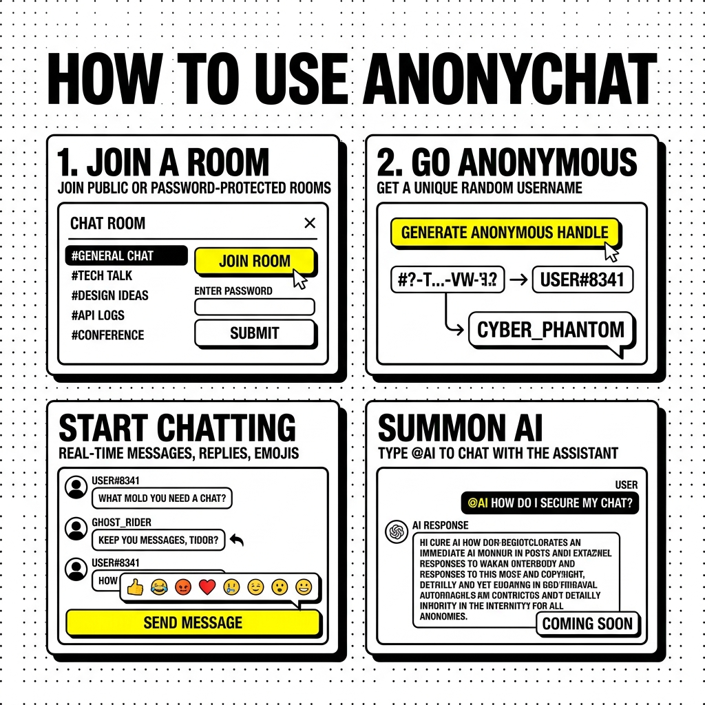

# ANONYCHAT 🔒

A modern, real-time anonymous chat application featuring secure authentication, instant messaging, and AI-powered assistance.

## 📖 How it Works

## ✨ Features

- 🔐 **Anonymous Chat** - Random usernames per room for privacy
- ⚡ **Real-Time Messaging** - Powered by Socket.io
- 🔗 **Message Threading** - Reply and organize conversations
- 👥 **@Mentions** - Tag users and AI assistant
- 🎨 **Dark/Light Theme** - Sleek neobrutalist design
- 😊 **Emoji Picker** - Express yourself
- 🔍 **Message Search** - Find conversations quickly
- 🔒 **Password-Protected Rooms** - Private conversations
- 🤖 **AI Assistant** - Powered by Google Gemini (optional)
- ⌨️ **Typing Indicators** - See who's composing
- 📊 **Online User Count** - Track room activity

## 🛠️ Tech Stack

**Frontend:**
- React 19 + Vite
- Socket.io Client
- Firebase Authentication
- Tailwind CSS
- Emoji Picker React

**Backend:**
- Node.js + Express
- Socket.io
- Firebase Admin SDK
- Google Generative AI (Gemini)

## 🚀 Getting Started

See [Deployment Guide](deployment_guide.md) for detailed instructions.

## 📄 License

MIT License
